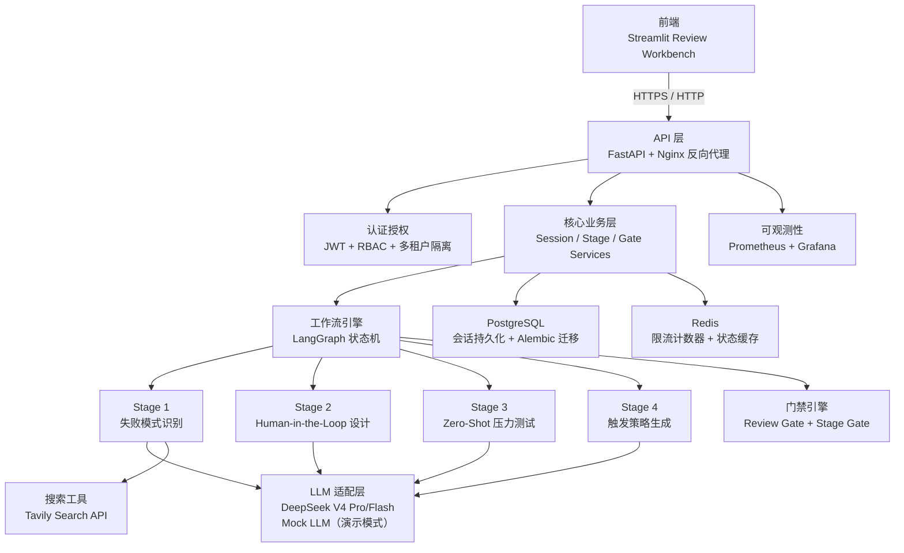
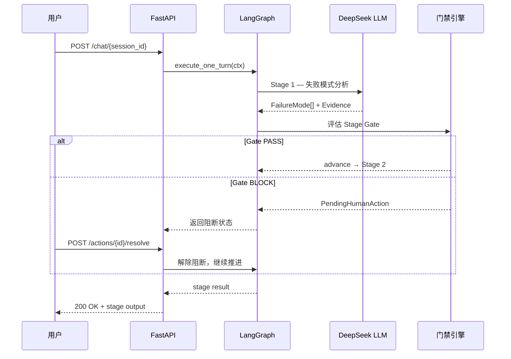

# Architecture

This project is an AI Workflow Pre-mortem & Human Oversight Tool, not a general workflow builder.

---

## 系统架构总览



---

## 四阶段工作流时序



---

## Runtime Path

Current request execution flows through `SessionService` and the execution-mode coordinator before entering the graph runner:

```text
FastAPI / Streamlit
-> SessionService
-> core.execution_service.execute_one_turn(ctx)
   -> single_step
      -> graph.runner.run_one_step(ctx)
   -> langgraph_interrupt experimental mode
      -> graph.langgraph_interrupt_runner.invoke_one_turn_with_interrupts(ctx)
-> graph.nodes
-> StageExecutor
-> Review Gate
-> PendingHumanAction / SafetyFinding / EvidenceSource / EvalCase / EvalRun
-> PostgreSQL + Redis cache
```

`single_step` remains the default stable path. `langgraph_interrupt` is an experimental adapter path selected only through `WORKFLOW_EXECUTION_MODE=langgraph_interrupt`.

## Review and Action Resolution Path

Human review actions are resolved through service-layer coordination rather than by support modules advancing stages directly:

```text
FastAPI / Streamlit
-> SessionService (orchestration layer)
-> core.oversight_service.resolve_action(...)
   -> assert_action_resolution_allowed -> graph.transition_policy.evaluate_action_resolution(...)
-> SessionService.after_human_resolution -> stage_advancement_coordinator
   -> core.execution_service.sync_execution_after_action_resolution(...)
      -> single_step: no checkpoint mutation
      -> langgraph_interrupt: mark interrupt resumed/cancelled and consume resume once
-> stage gate re-evaluation
```

Note: `SessionService` is the orchestrator — `oversight_service.resolve_action` validates and resolves the action (delegating the policy check to `transition_policy`), then `SessionService` triggers execution synchronization via the stage advancement coordinator. The three modules run in the order shown, but are not chained inside `oversight_service`.

Stage rerun, revise, rollback, and sync-review-actions are explicit stage operations under `core.stage_operation_service` and `api.routers.stage`.

## Core Principles

- Workflow transitions are deterministic and code-controlled.
- LLMs generate analysis, not autonomous workflow transitions.
- High-risk decisions require human review.
- Evidence, safety findings, eval cases, eval runs, interrupt records, and report artifacts are first-class records.
- Graph, API, frontend, and reports consume the same stage readiness contract.
- Full runtime validation is intentionally separate from dependency-light contract tests.

## Key coordination points

（自 v1.0.0 确立，v1.3.0 复核仍然有效）

- `core/version.py` is the version source of truth.
- `core/stage_readiness_service.py` is the authoritative stage gate source.
- `graph/transition_policy.py` keeps backward-compatible transition and action-resolution helpers.
- `core/stage_resolution_service.py` maps blockers to concrete next operations.
- `core/stage_operation_service.py` performs explicit non-runtime stage operations.
- `core/execution_service.py` centralizes execution-mode dispatch and interrupt synchronization.
- `FailureMode.evidence_ids` preserves structured evidence references.
- User materials are represented as `EvidenceSource(source_type="user_material")`.
- Eval coverage and high-risk eval review are part of the Stage 3 gate.


## Doc/Test/Core Alignment Contract

Stage readiness, resolution, and advancement-decision contracts are enforced through the service layer (`core/stage_readiness_service.py`, `core/stage_resolution_service.py`, `core/stage_advancement_decision.py`) and validated by dedicated tests in `tests/`.

Runtime validation requires the full dependency/service environment: FastAPI startup, Streamlit startup, Docker compose, PostgreSQL, Redis, Tavily, real LLM calls, and end-to-end workflow replay.
